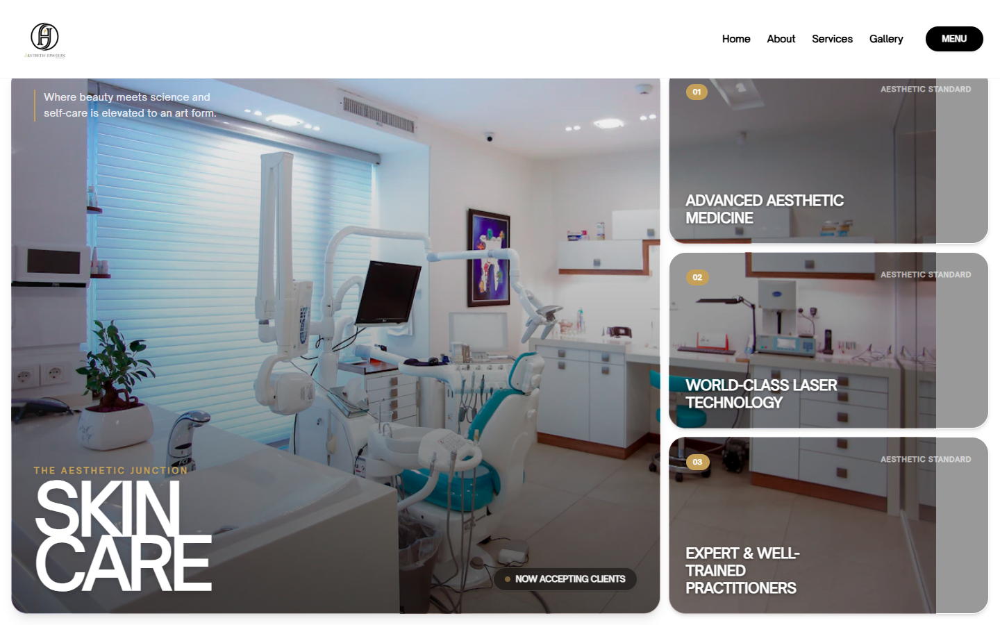

# The Aesthetic Junction

**[Live demo →](https://aayansheraz.github.io/the-aesthetic-junction/)**



Marketing website for **The Aesthetic Junction**, an aesthetic & cosmetic clinic in Okara — editorial typography, scroll-reveal galleries and a service showcase with a "now accepting clients" call to action.

Built with **React + TypeScript + Vite + Tailwind CSS v4 + Motion (Framer Motion)**.

## Highlights

- Editorial hero with oversized display type and layered imagery
- Scroll-triggered reveals across services, gallery and about sections
- Fully static build — no backend required

## Run locally

```bash
npm install
npm run dev      # http://localhost:3000
```

## Build for hosting

```bash
npm run build
```

Upload the contents of `dist/` to any static host (Vercel, Netlify, GitHub Pages, or shared hosting).
