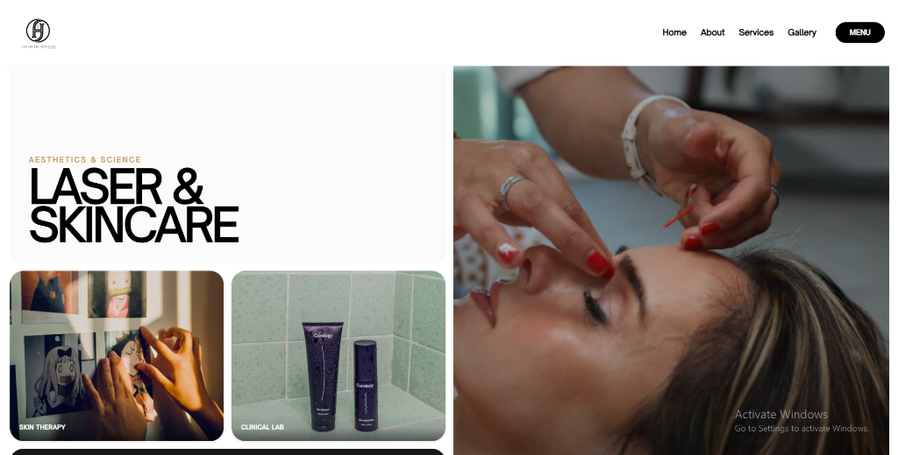

# The Aesthetic Junction — Medical & Cosmetic Clinic Web App

[](https://github.com/aayansheraz/the-aesthetic-junction/actions/workflows/ci.yml)
[](https://aayansheraz.github.io/the-aesthetic-junction/)
[](https://react.dev/)
[](https://www.typescriptlang.org/)
[](https://tailwindcss.com/)
[](https://framer.com/motion)

**[🚀 View Live Clinic Application →](https://aayansheraz.github.io/the-aesthetic-junction/)**



A commercial marketing web application engineered for **The Aesthetic Junction**, a premier cosmetic clinic in Okara. Features smooth scroll reveals, service treatment showcases, client appointment inquiry routing, and responsive mobile-first navigation.

Built with **React + TypeScript + Vite + Tailwind CSS v4 + Framer Motion**.

---

## 🌟 Key Features

- **Clinic Treatment Showcase:** Animated service cards showcasing skincare, dermatological, and cosmetic treatments.
- **Scroll-Triggered Motion:** 60fps micro-interactions and section transitions powered by Framer Motion.
- **Direct Appointment Inquiry Flow:** Seamless WhatsApp and phone booking routing for patient convenience.
- **Automated CI Pipeline:** GitHub Actions continuous integration workflow for automated build checks.

---

## 💻 Local Development Setup

```bash
# Install dependencies
npm install

# Run local development server
npm run dev
```

---

## 📦 Production Build

```bash
npm run build
```

---

## 📄 License

This project is licensed under the MIT License - see the [LICENSE](LICENSE) file for details.
